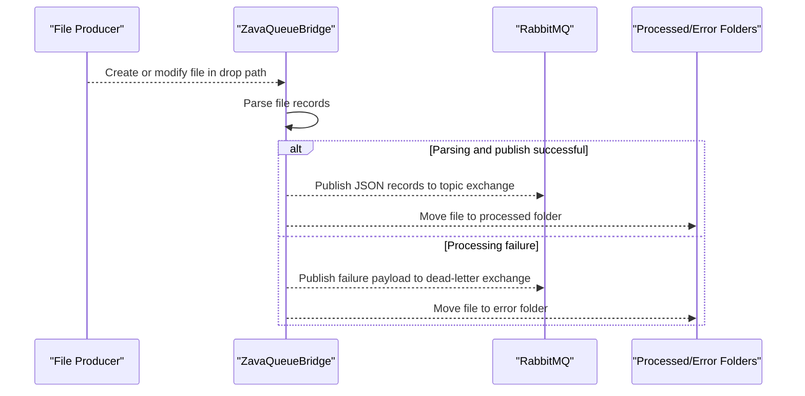

# API & Service Communication Contracts

This project exposes no HTTP API surface; it is a file-to-queue bridge service. Communication is asynchronous via RabbitMQ exchanges.

## Service Catalog

| Service | Port | Category | Purpose |
|---|---|---|---|
| ZavaQueueBridge | N/A (process service) | Business | Watches file drop path, parses records, publishes queue messages |
| RabbitMQ broker (external) | 5672 (default from config) | Infrastructure | Receives topic and dead-letter messages |

## API Endpoints Inventory

| Service | Method | Path | Request Type | Response Type |
|---|---|---|---|---|
| ZavaQueueBridge | N/A | N/A | File drop events (`.csv`, `.txt`, `.dat`) | RabbitMQ messages (JSON payload) |

## Management & Observability Endpoints

| Service | Endpoint | Custom Metrics (if any) |
|---|---|---|
| ZavaQueueBridge | None detected | None detected |

## DTOs & Contracts

The primary contract is a JSON message generated from `Dictionary<string, object>` and published to RabbitMQ. Payload structure includes `sourceFile`, `processedAt`, and `record` for successful processing; dead-letter messages include `sourceFile`, `error`, and `failedAt`. No OpenAPI, protobuf, or GraphQL schemas are present.

## Communication Patterns

Communication is asynchronous through RabbitMQ `BasicPublish` operations to a topic exchange (`filedrop.events`) and dead-letter fanout exchange (`zava.dlx`). No service discovery, gateway, circuit breaker, or retry library is configured; error handling is performed by local exception handling plus dead-letter publishing. No TLS/authentication controls are visible in code-level messaging configuration beyond broker username/password values loaded from configuration.

## Service Technology Matrix

| Service | Web | Data Access | Discovery | Gateway | Actuator | Cache | Metrics |
|---|---|---|---|---|---|---|---|
| ZavaQueueBridge | None | File system reads/moves | None | None | None | None | None |

## Service Communication Sequence

