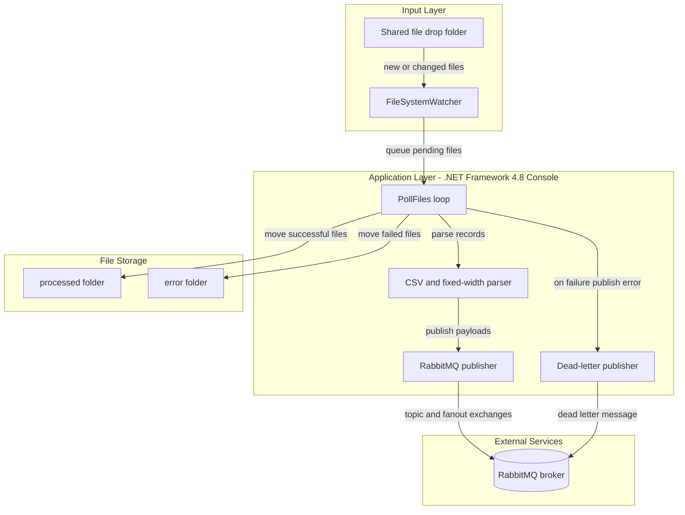
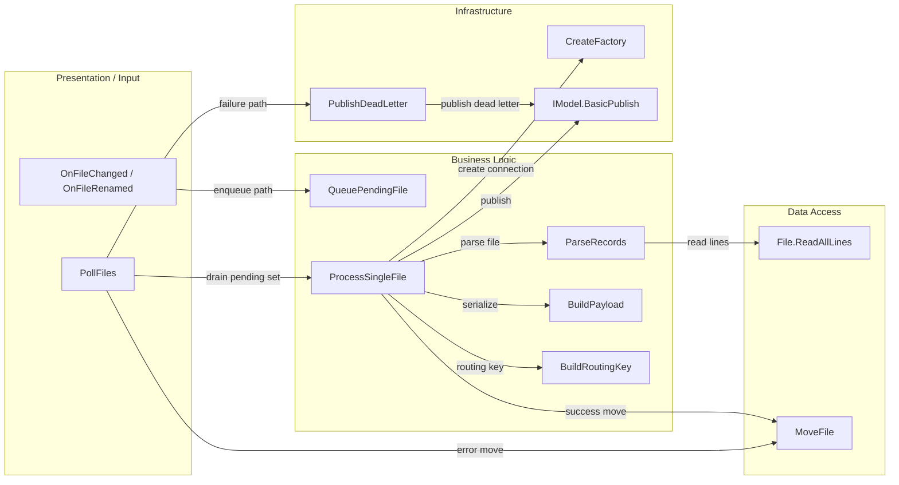

# Architecture Diagram

This application is a single-process file ingestion bridge that watches a shared directory, parses records, and publishes messages to RabbitMQ. It has no web UI or HTTP API layer.

## Application Architecture

### Technology Stack Summary

| Layer | Technology | Version | Purpose |
|---|---|---|---|
| Runtime | .NET Framework Console App | 4.8 | Executes polling, parsing, and publishing loop |
| Messaging | RabbitMQ.Client | 5.2.0 | Publishes file-derived messages and dead letters |
| Serialization | System.Web.Script.Serialization | .NET Framework library | Serializes payload dictionaries to JSON |
| File I/O | System.IO + FileSystemWatcher | .NET Framework library | Watches drop path and moves processed/error files |
| Container Runtime | Mono image | 6.12 | Builds and runs .NET Framework app on Linux |

### Data Storage & External Services

The process uses filesystem directories as transient storage (`drop`, `processed`, `error`) and RabbitMQ as its external integration point. No database, cache, or external HTTP service dependency is declared.

### Key Architectural Decisions

- Uses a polling loop plus `FileSystemWatcher` events to handle both existing and newly arriving files.
- Uses topic exchange routing keys based on file extension (`filedrop.csv`, `filedrop.txt`, etc.).
- Implements dead-letter publishing and file quarantine (`error` folder) for failed file processing.

## Component Relationships

### Component Inventory

| Component | Layer | Type | Responsibility |
|---|---|---|---|
| `Program.Main` | Presentation / Input | Entry point | Initializes config, watcher, and polling loop |
| `OnFileChanged`, `OnFileRenamed` | Presentation / Input | Event handlers | Capture filesystem events and enqueue candidate files |
| `PollFiles` | Business Logic | Orchestrator | Batches pending files and coordinates publish flow |
| `ProcessSingleFile` | Business Logic | Processing service | Parses records, publishes messages, and routes output files |
| `ParseCsv`, `ParseFixedWidth` | Business Logic | Parsers | Transforms source file lines into record dictionaries |
| `CreateFactory` | Infrastructure | Connection factory | Builds RabbitMQ connection configuration |
| `PublishDeadLetter` | Infrastructure | Error handler | Sends failed file metadata to dead-letter exchange |
| `MoveFile` | Data Access | File operation | Persists processing outcome by relocating files |
