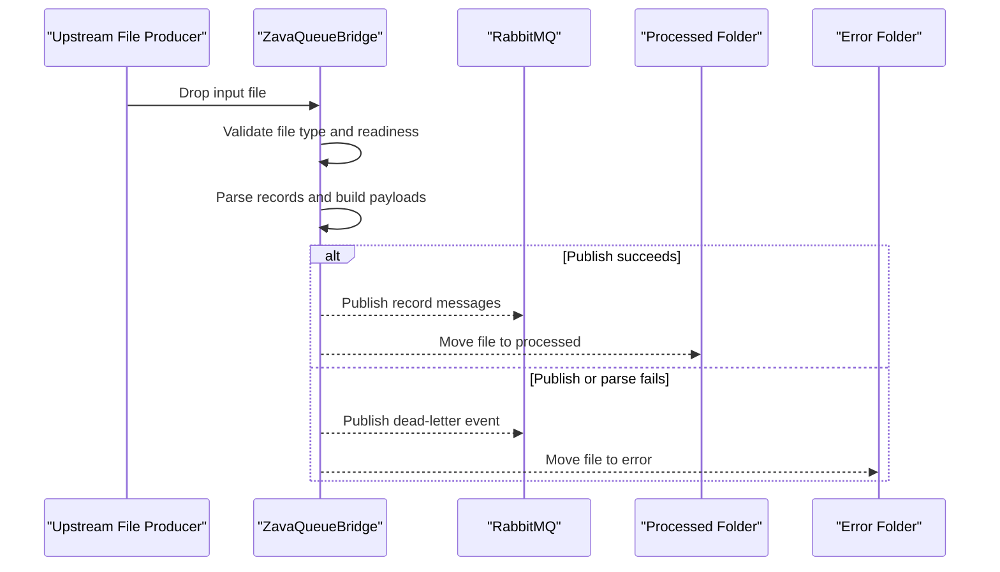

# Core Business Workflows

The application’s core business purpose is to transform inbound bank file drops into queue events for downstream consumers. It also enforces operational workflow outcomes by separating successful and failed files.

## Domain Entities

| Entity | Service / Bounded Context | Description | Key Relationships |
|---|---|---|---|
| File Event | Queue Bridge Processing | Represents an incoming file to be processed | Produces many record payload messages |
| Record Payload | Queue Bridge Processing | Message content derived from each parsed record | Published to RabbitMQ topic exchange |
| Dead Letter Event | Queue Bridge Error Handling | Failure event for file-level processing errors | Published to dead-letter exchange |
| Processing Outcome | Queue Bridge Processing | Final state of handled file (processed/error) | Determines destination folder |

## Service-to-Domain Mapping

| Service | Domain Context | Owned Entities | External Dependencies |
|---|---|---|---|
| ZavaQueueBridge | File-to-Queue Transformation | File Event, Record Payload, Dead Letter Event, Processing Outcome | RabbitMQ broker, shared file drop path |

## Primary Workflows

### Workflow 1: Ingest and Publish File Records

1. File producer drops or updates `.csv`, `.txt`, or `.dat` file in monitored path.
2. Bridge queues the file path and collects it in the polling cycle.
3. Bridge validates readiness, parses records (CSV header-based or fixed-width mapping), and builds JSON payloads.
4. Bridge publishes one message per record to the configured topic exchange.
5. Bridge moves file to `processed` folder after successful publication.

### Workflow 2: Error Handling and Quarantine

1. If parsing or publish fails, bridge captures exception context.
2. Bridge emits a dead-letter message with source file and error details.
3. Bridge moves failed file to `error` folder for manual follow-up.

## Cross-Service Data Flows

The bridge composes file system data with runtime metadata into queue messages and sends them to RabbitMQ. There is no downstream response aggregation flow in this codebase. Fallback behavior is business-visible: failed files are isolated in `error` and represented as dead-letter events.

## Business Workflow Sequence

## Business Rules & Decision Logic

- Only files with `.csv`, `.txt`, or `.dat` extensions are eligible for processing.
- Empty files are rejected with an error path outcome.
- Routing key is derived from file extension and defaults to `unknown` when absent.
- Processed files are moved to `processed`; failed files are moved to `error` and emit dead-letter messages.
- File name collisions in destination folders are resolved by timestamp prefixing.
