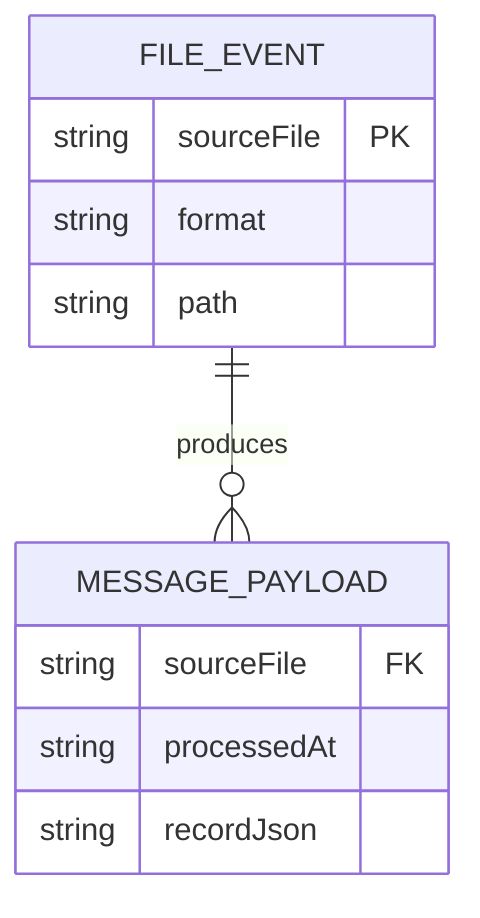

# Data Architecture & Persistence Layer

The application has no relational or document database persistence layer; it is centered on file ingestion and message publication. Data is transiently represented in in-memory dictionaries and serialized to message payloads.

## Database Configuration

| Service/Module | DB Type | Profile | Driver | Connection | Migration Tool |
|---|---|---|---|---|---|
| ZavaQueueBridge | None detected | Default | N/A | N/A | N/A |

## Data Ownership per Service

| Service | Tables Owned | ORM Framework | Caching | Notes |
|---|---|---|---|---|
| ZavaQueueBridge | None | None | None | Uses filesystem directories and RabbitMQ instead of DB |

## Entity Model

## Key Repository Methods

| Service | Repository | Notable Methods | Purpose |
|---|---|---|---|
| ZavaQueueBridge | N/A | `ParseCsv`, `ParseFixedWidth`, `MoveFile` | Performs file parsing and storage transitions without repository abstraction |

## Caching Strategy

No cache provider, cache region, or cache annotations are configured. The in-memory pending file set is an execution queue, not a reusable cache layer.

## Data Ownership Boundaries

The service owns local filesystem workflow state (`drop`, `processed`, `error`) and emits derived message payloads to RabbitMQ. There is no shared database and no cross-service database access pattern.

### Data Classification & Sensitivity

| Entity | Sensitive Fields | Classification (PII/PHI/PCI/None) | Controls in Place |
|---|---|---|---|
| `record` payload dictionary | Depends on inbound file content | Potential PII (content-dependent) | No explicit masking or encryption controls in code |
| Dead-letter payload | `sourceFile`, `error` | None by default (may include sensitive error text) | No explicit masking |
