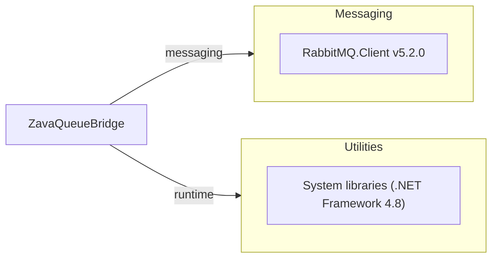

# Dependency Map

This .NET Framework 4.8 console application declares one external package dependency and relies otherwise on framework-provided libraries.

## Dependencies

### Dependency Summary

| Category | Count | Key Libraries | Notes |
|---|---:|---|---|
| Messaging | 1 | RabbitMQ.Client 5.2.0 | Used to publish business and dead-letter messages |
| Utilities | 1 | .NET Framework Base Class Library | File I/O, configuration, collections, serialization |

### Version & Compatibility Risks

The application targets legacy .NET Framework 4.8 and uses RabbitMQ.Client 5.2.0, which is an older client line compared with current major versions. Migration to modern .NET may require package updates and compatibility validation.

### Notable Observations

- `packages.config` is used instead of modern `PackageReference`.
- No test-scoped package dependencies are declared.
- Build process assumes Mono toolchain (`nuget` + `msbuild`) in container.

## Test Dependencies

| Framework | Version | Notes |
|---|---|---|
| None detected | N/A | No test packages declared in project files |

Total test-scope dependencies: 0
No test dependencies detected.
