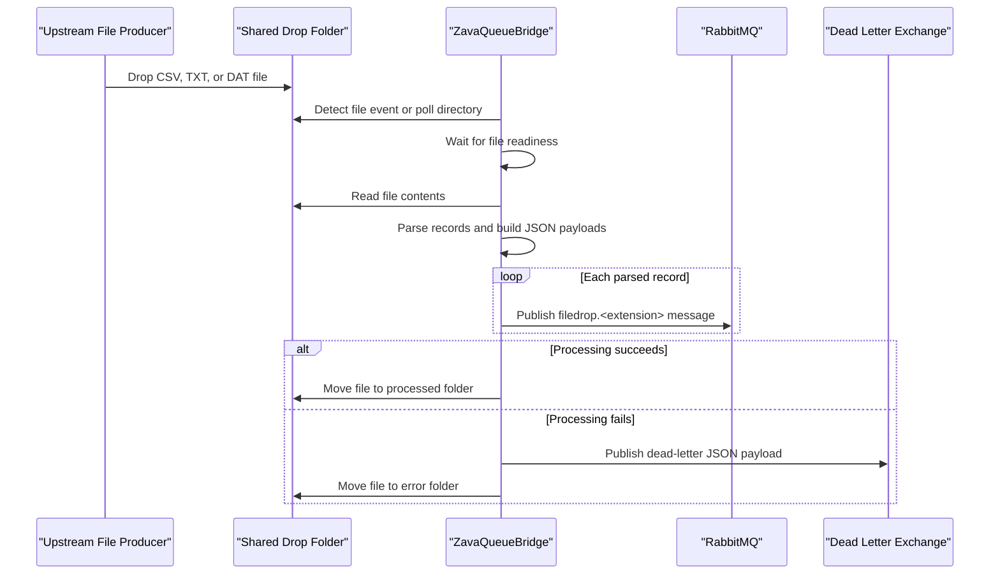

# API & Service Communication Contracts

ZavaQueueBridge does not expose an HTTP API surface. Its externally visible contract is an asynchronous file-to-message flow in which flat files dropped into a shared directory are transformed into JSON messages and published to RabbitMQ exchanges.

## Service Catalog

| Service | Port | Category | Purpose |
| --- | --- | --- | --- |
| ZavaQueueBridge | N/A | Business | Watches a shared file drop, parses supported file formats, and publishes messages to RabbitMQ |
| RabbitMQ broker | 5672 | Infrastructure | Receives topic messages for parsed records and fanout dead-letter events |

## API Endpoints Inventory

No HTTP API endpoints, controllers, or route definitions were detected in the repository. The effective input contract is file arrival in the configured drop folder, and the effective output contract is RabbitMQ JSON messages keyed by file extension.

## Management & Observability Endpoints

| Service | Endpoint | Custom Metrics |
| --- | --- | --- |
| ZavaQueueBridge | None detected | None detected |

## DTOs & Contracts

The application uses transient in-memory contracts rather than explicit DTO classes. `BuildPayload` creates a JSON envelope containing `sourceFile`, `processedAt`, and a `record` dictionary populated from CSV headers or fixed-width fields. `PublishDeadLetter` emits a second JSON contract containing `sourceFile`, `error`, and `failedAt` when processing fails. No OpenAPI, Swagger, protobuf, or GraphQL contracts were found. Serialization is handled with `JavaScriptSerializer`, and the payload models are mutable dictionary-based structures rather than immutable records.

## Communication Patterns

Communication is primarily asynchronous. The bridge receives work through file-system events and periodic directory polling, then publishes one RabbitMQ topic message per parsed record using routing keys of the form `filedrop.<extension>`. When processing fails, it publishes a dead-letter notification to the configured fanout exchange and moves the source file into the error directory. There is no service discovery, API gateway, client-side load balancing, retry library, circuit breaker, or explicit timeout policy in the code. The only built-in resiliency behavior is a short five-attempt wait loop that checks whether a file can be opened before parsing. No TLS, authentication handshake, or authorization rules are configured in code beyond the RabbitMQ username and password connection settings.

## Service Technology Matrix

| Service | Web | Data Access | Discovery | Gateway | Actuator | Cache | Metrics |
| --- | --- | --- | --- | --- | --- | --- | --- |
| ZavaQueueBridge | None | File system reads and RabbitMQ publish calls | None | No | No | None | Console logging |
| RabbitMQ broker | N/A | Queue and exchange storage | None | No | N/A | N/A | N/A |

## Service Communication Sequence

