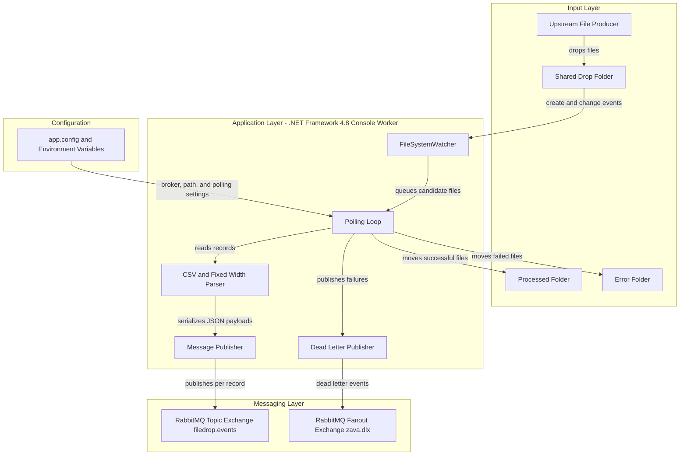
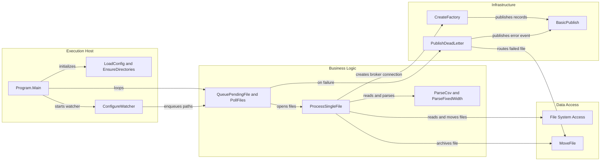

# Architecture Diagram

ZavaQueueBridge is a single-process file ingestion worker that watches a shared folder, parses inbound flat files, and publishes JSON messages to RabbitMQ. Its architecture is centered on local file-system coordination and asynchronous broker communication rather than HTTP endpoints or a database.

## Application Architecture

### Technology Stack Summary

| Layer | Technology | Version | Purpose |
| --- | --- | --- | --- |
| Execution | .NET Framework console application | 4.8 | Hosts the long-running file bridge worker |
| File ingestion | System.IO FileSystemWatcher and directory polling | .NET Framework | Detects and batches inbound files from the shared drop folder |
| Messaging | RabbitMQ.Client | 5.2.0 | Publishes parsed records and dead-letter events to RabbitMQ |
| Serialization | JavaScriptSerializer | .NET Framework | Converts parsed records into JSON payloads |
| Configuration | app.config plus environment-variable overrides | N/A | Externalizes broker, path, and poll interval settings |

### Data Storage & External Services

The application does not use a database or cache. Its persistent integration points are the shared file-system directories used for inbound, processed, and error files, plus a RabbitMQ broker that receives per-record topic messages and dead-letter notifications when processing fails.

### Key Architectural Decisions

- Uses a hybrid watcher plus polling model so new files can be discovered both from file-system events and periodic directory scans.
- Publishes one RabbitMQ message per parsed record, allowing downstream consumers to process file contents independently of the original file.
- Treats the file system as the operational state store by moving files into processed or error directories after each run.

## Component Relationships

### Component Inventory

| Component | Layer | Type | Responsibility |
| --- | --- | --- | --- |
| Program.Main | Execution Host | Console entry point | Loads configuration, prepares directories, configures the watcher, and drives the polling loop |
| LoadConfig and EnsureDirectories | Execution Host | Startup helpers | Resolve configuration from environment variables and create required folders |
| ConfigureWatcher | Execution Host | File watcher setup | Subscribes to file create, change, and rename events for the drop folder |
| QueuePendingFile and PollFiles | Business Logic | Work coordinator | Deduplicates candidate files and processes each pending batch |
| ProcessSingleFile | Business Logic | File processing service | Waits for file readiness, parses records, publishes messages, and archives the file |
| ParseCsv and ParseFixedWidth | Business Logic | Record parsers | Convert inbound flat-file content into normalized record dictionaries |
| CreateFactory and BasicPublish | Infrastructure | Messaging adapter | Open RabbitMQ connections and publish topic messages |
| PublishDeadLetter | Infrastructure | Error publisher | Emits failure payloads to the dead-letter exchange when file processing fails |
| MoveFile | Data Access | File archive helper | Moves processed or failed files into their destination folders |
