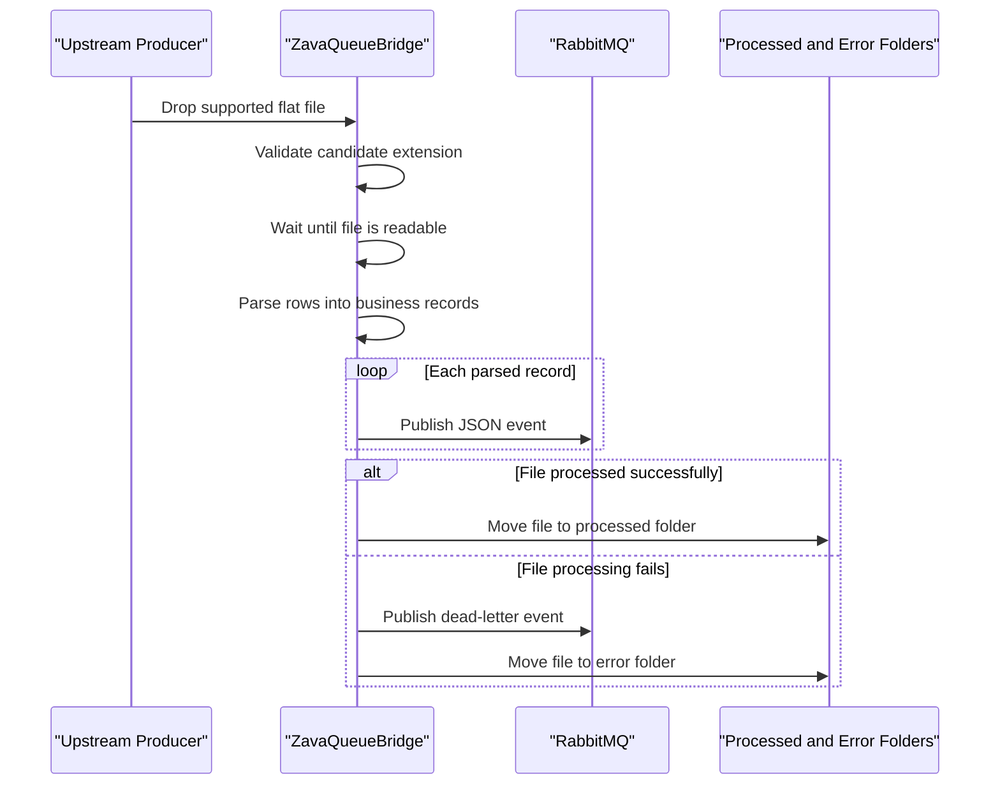

# Core Business Workflows

ZavaQueueBridge automates the handoff of operational flat files into the bank's messaging backbone. Its business purpose is to turn shared-folder drops into durable RabbitMQ events while segregating successful and failed file processing outcomes.

## Domain Entities

| Entity | Service / Bounded Context | Description | Key Relationships |
| --- | --- | --- | --- |
| Input File | File Intake | Source artifact dropped by an upstream process for asynchronous ingestion | Produces one or more parsed records and is eventually moved to processed or error storage |
| Parsed Record | File Intake | Normalized representation of one CSV row or fixed-width line | Becomes the payload of a queue message |
| Queue Message | Messaging Handoff | JSON event published for downstream consumers | Derived from a parsed record and routed by file extension |
| Dead-Letter Event | Exception Handling | Failure notification emitted when a file cannot be processed | References the source file and processing error |
| Archived File | Operational State | File moved to processed or error storage after handling | Represents the final operational state of an input file |

## Service-to-Domain Mapping

| Service | Domain Context | Owned Entities | External Dependencies |
| --- | --- | --- | --- |
| ZavaQueueBridge | File Intake and Messaging Handoff | Input File, Parsed Record, Queue Message, Dead-Letter Event, Archived File | Shared file system, RabbitMQ broker |

## Primary Workflows

### Workflow 1: Successful file ingestion and publish

1. An upstream producer writes a supported file into the configured drop folder.
2. The bridge detects the file through `FileSystemWatcher` events or the periodic polling cycle.
3. Candidate-file rules admit only `.csv`, `.txt`, and `.dat` files and ignore processed and error folders.
4. The worker waits briefly for the file to become readable, parses each record, and builds a JSON payload.
5. One RabbitMQ message is published per parsed record using a routing key derived from the source file extension.
6. After all records are published, the source file is moved into the processed directory.

### Workflow 2: Failed file handling

1. If parsing or publishing throws an exception, the bridge logs the failure and builds a dead-letter payload.
2. The dead-letter event is published to the configured fanout exchange so downstream operators or consumers can react.
3. The original file is moved into the error directory, preserving operational evidence that the file did not complete normally.

## Cross-Service Data Flows

There is no HTTP or multi-service aggregation layer in this repository. Data flows from an upstream file producer through the shared file system into ZavaQueueBridge, then out to RabbitMQ as per-record events. Failure data follows a parallel path to the dead-letter exchange. Because the application is the only source of truth for file-processing status, business degradation is expressed through where the file is archived rather than through API fallback responses.

## Business Workflow Sequence

## Business Rules & Decision Logic

- Only files with `.csv`, `.txt`, or `.dat` extensions are eligible for ingestion.
- Paths named `processed` or `error` are excluded from candidate-file handling.
- CSV files treat the first line as headers; fixed-width files are split into `RecordType`, `CustomerId`, `AccountId`, `Amount`, and `Details` segments.
- The routing key is derived from the source file extension, defaulting to `filedrop.unknown` if no extension is present.
- Processing failures trigger both a dead-letter message and relocation of the original file to the error directory.
- There is no business authorization layer, approval workflow, or multi-step state machine beyond file eligibility, message publication, and archive routing.
