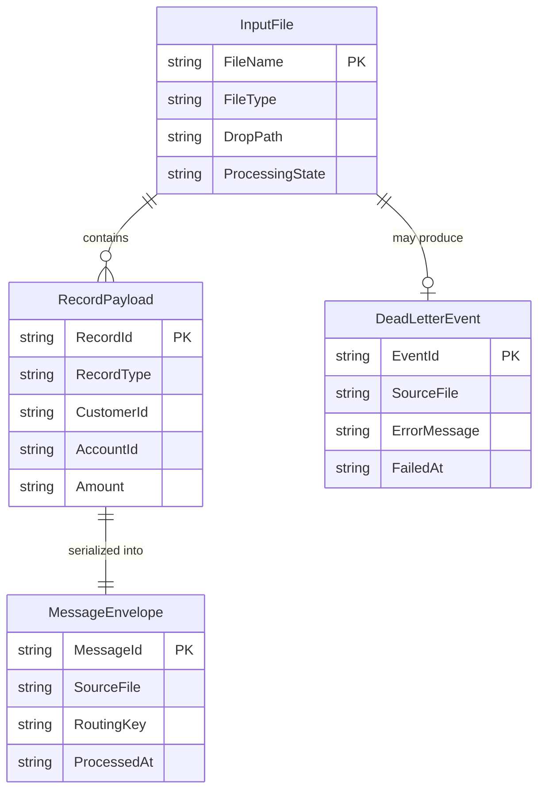

# Data Architecture & Persistence Layer

ZavaQueueBridge has no database, ORM, or repository layer. Its data model is transient and file-oriented: records are read from inbound flat files, converted into dictionary-based payloads, and then handed off to RabbitMQ for downstream processing.

## Database Configuration

| Service/Module | DB Type | Profile | Driver | Connection | Migration Tool |
| --- | --- | --- | --- | --- | --- |
| ZavaQueueBridge | None | Default | None | Shared file-system directories plus RabbitMQ broker connection settings | None |

## Data Ownership per Service

| Service | Tables Owned | ORM Framework | Caching | Notes |
| --- | --- | --- | --- | --- |
| ZavaQueueBridge | None | None | None | Operates on transient file records and archive directories instead of persistent tables |

## Entity Model

## Key Repository Methods

| Service | Repository | Notable Methods | Purpose |
| --- | --- | --- | --- |
| ZavaQueueBridge | None detected | N/A | The application uses direct file I/O, in-memory dictionaries, and RabbitMQ publish calls instead of repository abstractions |

## Caching Strategy

No caching layer was detected. Every poll cycle reads candidate files directly from the drop directory, parses them in memory, and immediately publishes the resulting messages.

## Data Ownership Boundaries

The application is a single-service bridge with no persistent data store of its own. Operational state is represented by file location: inbound files reside in the drop directory until processed, successful files are moved to the processed directory, and failures are routed to the error directory after a dead-letter event is emitted. Cross-service data access is not present; downstream systems receive messages through RabbitMQ rather than by sharing a database.

### Data Classification & Sensitivity

| Entity | Sensitive Fields | Classification (PII/PHI/PCI/None) | Controls in Place |
| --- | --- | --- | --- |
| InputFile | File name may encode business identifiers | None | No explicit masking or encryption controls detected |
| RecordPayload | CustomerId, AccountId, Amount, Details | None | No explicit masking, encryption-at-rest, or field-level access controls detected in code |
| DeadLetterEvent | SourceFile, ErrorMessage | None | No explicit masking or encryption controls detected |
