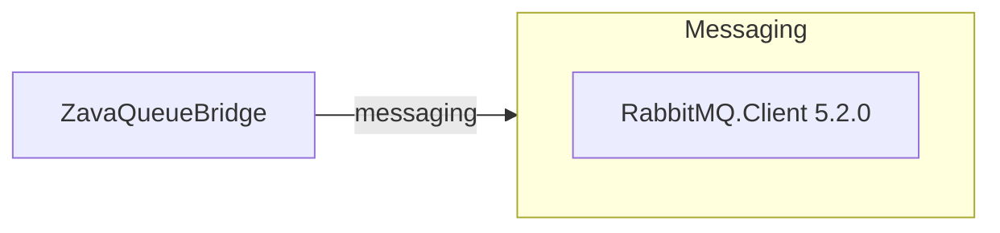

# Dependency Map

ZavaQueueBridge has a very small declared dependency surface: one third-party messaging client package and the .NET Framework runtime references required by the legacy project format. This makes the modernization dependency picture simple but highlights the age of the underlying platform.

## Dependencies

### Dependency Summary

| Category | Count | Key Libraries | Notes |
| --- | --- | --- | --- |
| Messaging | 1 | RabbitMQ.Client 5.2.0 | Provides AMQP connectivity and message publishing to RabbitMQ exchanges |

### Version & Compatibility Risks

The only external package is RabbitMQ.Client 5.2.0, which is materially older than current RabbitMQ client releases and is coupled to a legacy .NET Framework 4.8 application model. The larger compatibility risk is the platform itself: the project uses a non-SDK .NET Framework build that depends on classic MSBuild and framework reference assemblies rather than the cross-platform SDK-style toolchain.

### Notable Observations

- No test-only dependencies were declared in `packages.config`, matching the absence of a dedicated test project.
- The project relies on framework-provided libraries for configuration, JSON serialization, and file I/O instead of additional NuGet packages.
- The small package footprint should simplify dependency review, but the build remains constrained by legacy .NET Framework tooling.

## Test Dependencies

| Framework | Version | Notes |
| --- | --- | --- |
| None detected | N/A | No test-scoped packages or test projects were found |

Total test-scope dependencies: 0

No test dependencies detected.
